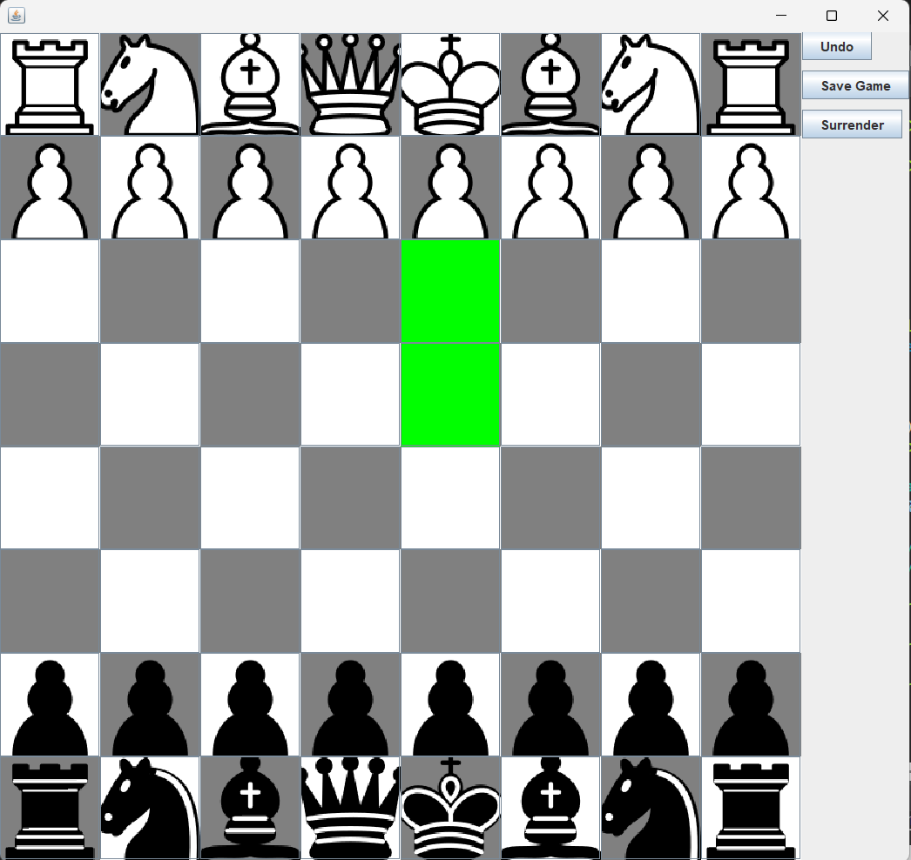

# HW-Chess

A feature-rich Chess application developed in Java using Swing for the GUI. The project follows modern software design patterns to ensure a modular and maintainable codebase.

## 🚀 Features

- **Single Player & Hotseat Multiplayer:** Play against a random-move AI or against a friend locally.
- **MVC Architecture:** Separation of concerns between the Game Logic (Model), Swing UI (View), and Game Flow (Controller).
- **Infinite Undo:** Implementation of the **Command Pattern** allows players to revert moves all the way back to the start of the game.
- **Save & Load:** Save your current game state to a file and resume later.
- **Pawn Promotion:** Full support for promoting pawns to Queen, Rook, Bishop, or Knight upon reaching the final rank.
- **Legal Move Highlighting:** Visual cues to show valid moves for the selected piece, including check-validation.
- **Checkmate Detection:** Automatic detection of game-over conditions.

## 🛠️ Architecture

The project was recently refactored to use a professional-grade architecture:
- **Model (`Board`, `Piece`, etc.):** Encapsulates the state of the chessboard and the rules of chess.
- **View (`ChessGUI`):** A passive interface that handles rendering and captures user input.
- **Controller (`GameController`):** Orchestrates the communication between the Model and View, managing turn logic and AI.
- **Commands (`MoveCommand`, `PieceMoveCommand`):** Encapsulates move logic into objects, enabling a robust Undo/Redo system.

## 📋 Prerequisites

- **Java Development Kit (JDK) 8 or higher** (JDK 17+ recommended).
- **Eclipse IDE** (Optional, but recommended for development).

## 🏃 How to Run

### From Eclipse:
1. Import the project into your workspace.
2. Right-click on your project and select **Refresh** (F5).
3. Right-click `src/ChessGUI.java`.
4. Select **Run As > Java Application**.

### From Command Line:
```bash
# Compile the project
javac -d bin src/*.java

# Run the project (Ensure the 'pieces' folder is in the working directory)
java -cp bin ChessGUI
```

## 📁 Project Structure

- `src/`: Contains all Java source files.
- `test/`: JUnit test cases for verifying chess logic.
- `pieces/`: Image assets for the chessboard pieces.
- `saves/`: Default directory for saved game files.

## 🏗️ Future Improvements

- [ ] Implement **Castling** and **En Passant**.
- [ ] Add **Stalemate** and other draw condition detections.
- [ ] Upgrade AI using the **Minimax** algorithm with Alpha-Beta pruning.
- [ ] Add a side panel for move history in Algebraic Notation.

## Screenshot from the game


